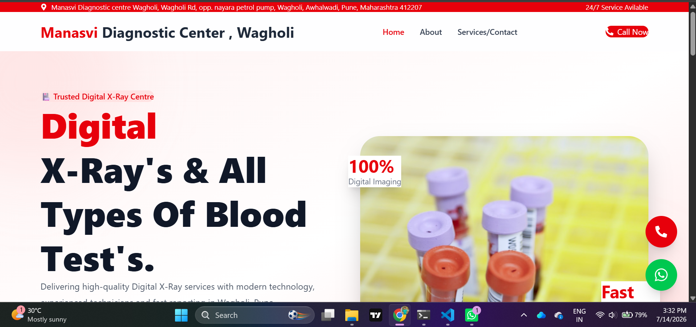
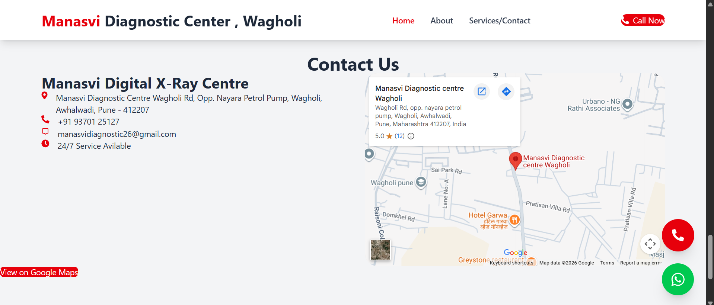
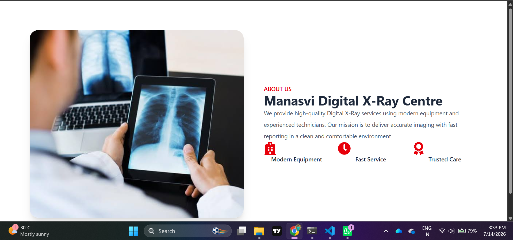
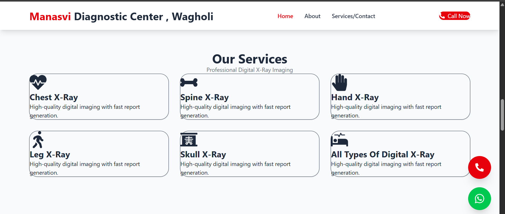
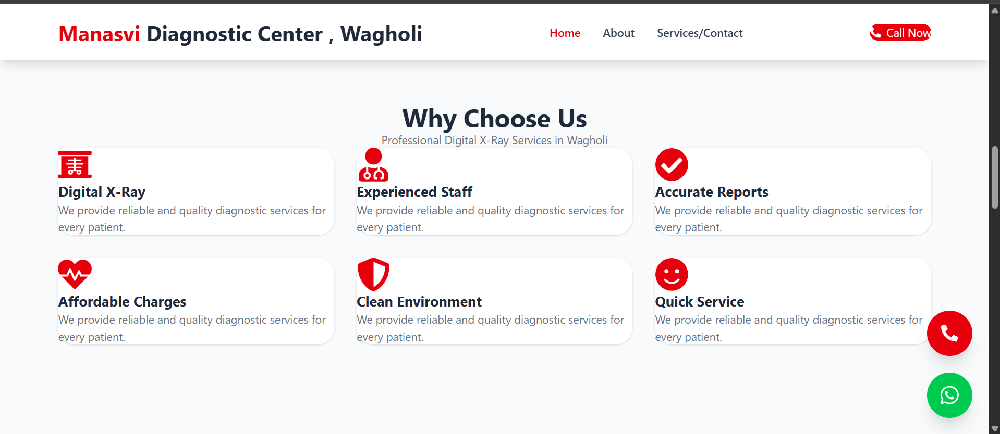
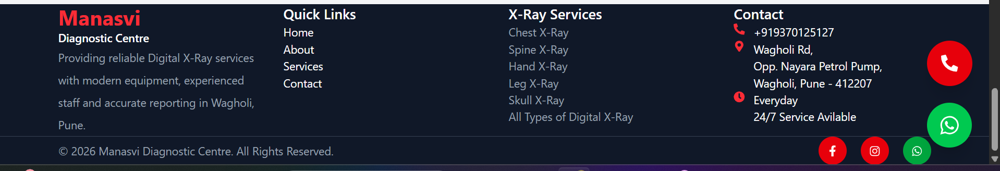

# 🏥 Manasvi Diagnostic Centre Website

A modern, responsive, and professional diagnostic center website developed using **React.js**, **Vite**, and **Tailwind CSS**. The website is designed to provide patients with easy access to information about the diagnostic center, available X-Ray services, gallery, contact information, and location.

---

## 🌐 Live Demo

🔗 https://manasvi-diagnostic-centre.vercel.app/


---

## 📸 Preview















---

## ✨ Features

- 🏥 Modern Healthcare UI
- 📱 Fully Responsive Design
- 🩻 Digital X-Ray Services Section
- ℹ️ About Centre
- ⭐ Why Choose Us
- 🏥 Equipment Information
- 🖼️ Gallery Section
- 📞 Click-to-Call Button
- 💬 WhatsApp Quick Chat
- 📍 Google Maps Integration
- 🕒 Working Hours
- 🎨 Clean & Professional Design
- ⚡ Fast Loading with Vite
- 🚀 SEO Friendly Structure

---

## 🛠️ Tech Stack

| Technology | Purpose |
|------------|---------|
| React.js | Frontend Framework |
| Vite | Build Tool |
| Tailwind CSS | Styling |
| React Router DOM | Routing |
| React Icons | Icons |
| AOS | Scroll Animations |
| Vercel | Deployment |

---

## 📂 Project Structure

```text
manasvi-diagnostic-centre/

├── public/
│   ├── images/
│   ├── logo.png
│   └── favicon.ico
│
├── src/
│   ├── components/
│   │   ├── layout/
│   │   └── sections/
│   │
│   ├── pages/
│   ├── App.jsx
│   ├── main.jsx
│   └── index.css
│
├── package.json
├── vite.config.js
└── README.md
```

---

## 🚀 Installation

Clone the repository

```bash
git clone https://github.com/rajmahadikrm/manasvi-diagnostic-centre.git
```

Go to project folder

```bash
cd manasvi-diagnostic-centre
```

Install dependencies

```bash
npm install
```

Run development server

```bash
npm run dev
```

Build for production

```bash
npm run build
```

Preview production build

```bash
npm run preview
```

---

## 📱 Responsive Design

The website is fully responsive and optimized for:

- 💻 Desktop
- 💼 Laptop
- 📱 Mobile
- 📲 Tablet

---

## 🎯 Main Sections

- Home
- About Us
- Digital X-Ray Services
- Why Choose Us
- Equipment Information
- Gallery
- Working Hours
- Contact
- Google Maps

---

## 📍 Business Information

**Manasvi Diagnostic Centre**

📍 Wagholi Rd, Opp. Nayara Petrol Pump  
Wagholi, Awhalwadi  
Pune, Maharashtra – 412207

📞 +919370125127

---

## 🚀 Deployment

The project is deployed on **Vercel**.

To deploy your own version:

```bash
npm run build
```

Upload the project to GitHub and import the repository into Vercel.

---

## 📈 Future Enhancements

- Admin Dashboard
- Appointment Booking
- Online Report Download
- Patient Login
- Online Payments
- Google Reviews Integration
- SEO Optimization
- Multi-language Support

---

## 👨‍💻 Developed By

**RAJ MAHADIK**

AI/ML Engineer | Full Stack Developer

GitHub:
https://github.com/rajmahadikrm

LinkedIn:
www.linkedin.com/in/rajmahadik


---

## 📄 License

This project was developed for educational and commercial portfolio purposes.

© 2026 Raj Mahadik. All Rights Reserved.